<div align="center">

# Indianapolis 500 Requalification Decision Support

### Physics-conditioned probabilistic inference for a decision that public history cannot fully identify

**FINAL_V2 frozen scientific core** · **2020–2024 reference era** · **2025 external regime evaluation** · **Human in the loop**

[Methodology](docs/methodology.md) · [Model card](docs/model-card.md) · [Validation](docs/validation.md) · [Evidence engineering](docs/evidence-engineering.md) · [Full report](docs/paper/physics_conditioned_probabilistic_performance_inference.pdf)

</div>

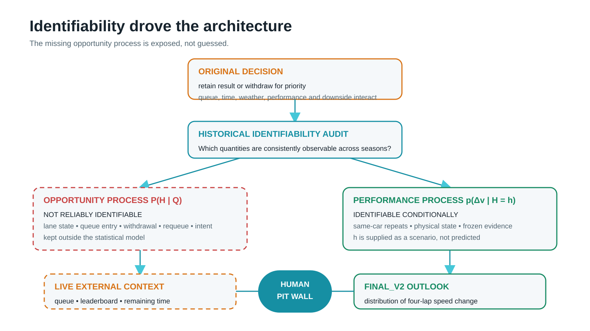

> **The key engineering result is a boundary.** Public historical evidence does not consistently reveal queue entry, Lane 1/Lane 2 state, withdrawals, requeue timing, pit return, live queue position or team intent. The project therefore does not guess an opportunity-time model or imitate historical decisions. It estimates the identifiable conditional performance problem and leaves the final retain/withdraw judgement to the pit wall.

## The system in one screen

| Evidence / result | Verified value | Meaning |
|---|---:|---|
| Frozen same-car transitions | **41** | Small, high-confidence performance core |
| Section-linked transitions | **39 / 41** | Mechanism evidence; sections are not independent rows |
| Scientific horizons | **15 / 30 / 60 / 90 / 120 min** | Independently fitted/calibrated anchors |
| Stress-test scenarios | **135** | Thermal gap × ambient path × solar state × horizon |
| 2025 external cases | **15** | Hybrid-era realized-weather retrospective evaluation |
| External MAE / RMSE | **0.492 / 0.610 mph** | Point-error scale across all 15 cases |
| External 80% / 90% PI coverage | **80% / 100%** | Empirical rates in a small external sample |
| External directional accuracy | **46.7%** | Weak direction discrimination, reported without concealment |

The model is more useful as a **probabilistic physical-opportunity envelope** than as a binary prediction that the next run will be faster. Of the 15 external cases, **4** lie inside the production boundary of ≤120 minutes; that subset has MAE **0.221 mph**, RMSE **0.269 mph**, 80% coverage **100%**, 90% coverage **100%**, and directional accuracy **50%**. These four cases are too few for a broad calibration claim.

## The engineering problem

After setting a valid four-lap average, an Indianapolis 500 entrant may retain it and wait in the lower-priority lane, or withdraw it to seek priority for another attempt. That choice combines at least three different processes:

1. **Opportunity:** whether and when another run becomes available.
2. **Physical performance:** how the car's four-lap performance distribution changes as conditions evolve.
3. **Utility:** how rank, bubble position, time remaining and downside risk affect the team decision.

Historical evidence was sufficient for the second process, but not for a consistently labelled first process. That finding changed the estimand from a complete strategy policy to:

> **If another on-track opportunity occurs _h_ minutes from now, what distribution of four-lap qualifying-performance change should be expected relative to the current official result?**

Formally, the project estimates **p(Δv | H = h)**. It does not estimate **P(H = h)**. Physical-performance inference, opportunity-time prediction and strategy recommendation remain separate layers.

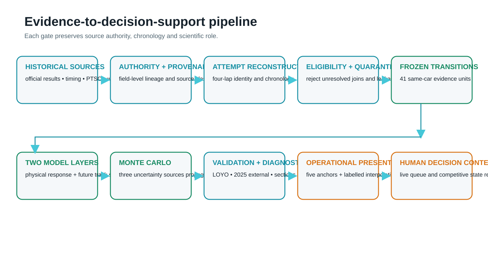

## Evidence engineering and data archaeology

The analysis began with official results and detailed reports, then reconciled attempts, chronology, section timing, observed track temperature, weather context and source authority. Every usable value carries evidence and eligibility semantics; unresolved joins remain quarantined.

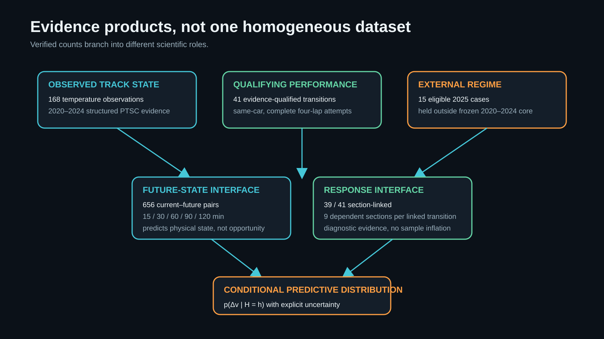

The two core datasets use different observational units. The performance response uses **41 same-car transitions**. The future-state layer uses **168 structured track-temperature observations**, transformed into **656 current–future pairs** at the supported horizons. Section evidence links to **39** transitions and contributes **351 dependent within-transition comparisons**, not 351 independent training examples.

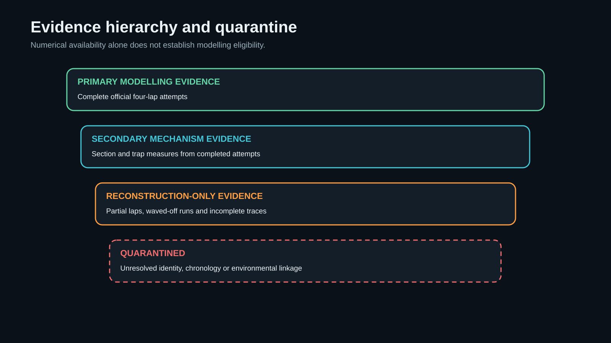

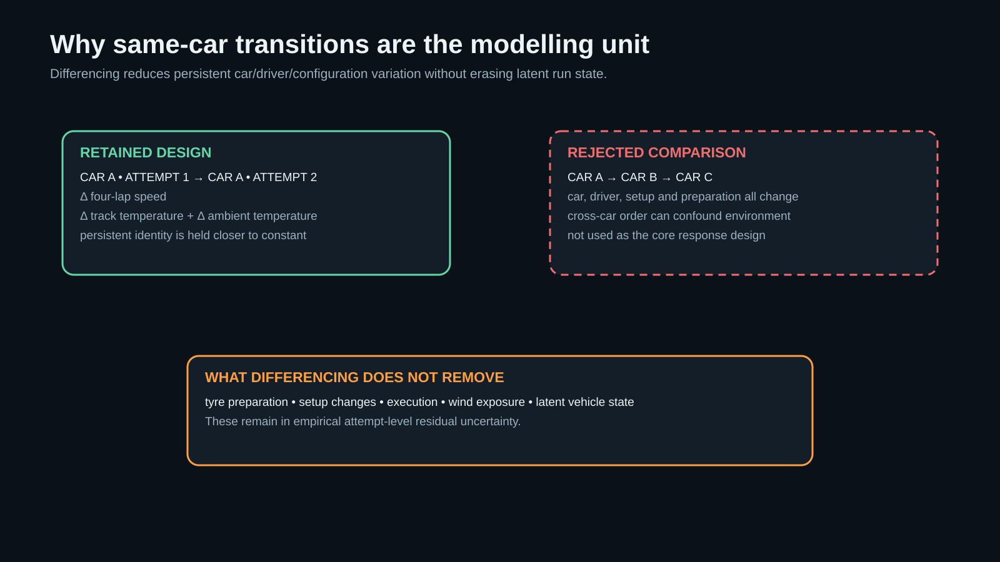

See [evidence engineering](docs/evidence-engineering.md), [data dictionary](docs/data-dictionary.md), and [identifiability boundary](docs/identifiability-boundary.md).

## Frozen physical-response model

The robust zero-intercept response model is:

```text
Δvphysical = βtrack ΔTtrack + βambient ΔTambient

βtrack   = −0.034825 mph / °C
βambient = +0.182393 mph / °C
```

The zero intercept encodes a narrow physical constraint: when both measured temperature changes are zero, the modelled thermal contribution is zero. It does **not** claim that realized speed change must be zero; tyre preparation, setup, execution, wind exposure and other latent run state remain in the residual distribution.

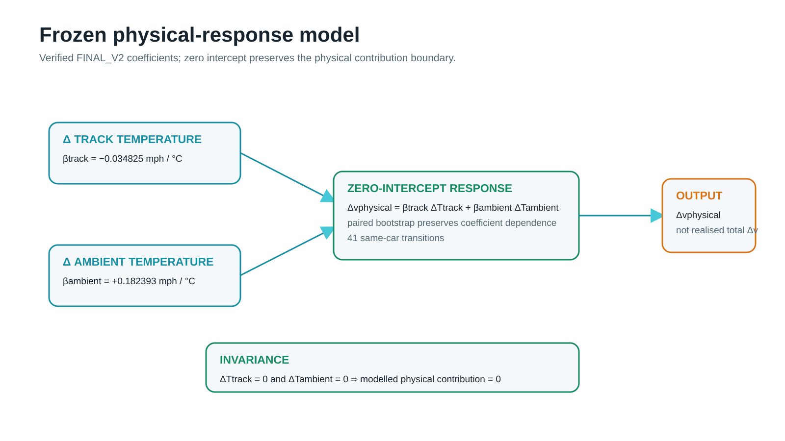

## Future physical state

Future track temperature is estimated separately from the performance response. The retained **M2b** specification conditions on future ambient-temperature change, the current track-to-ambient thermal gap and mean solar elevation. One model is fitted for each scientific horizon, selected through leave-one-year-out comparison.

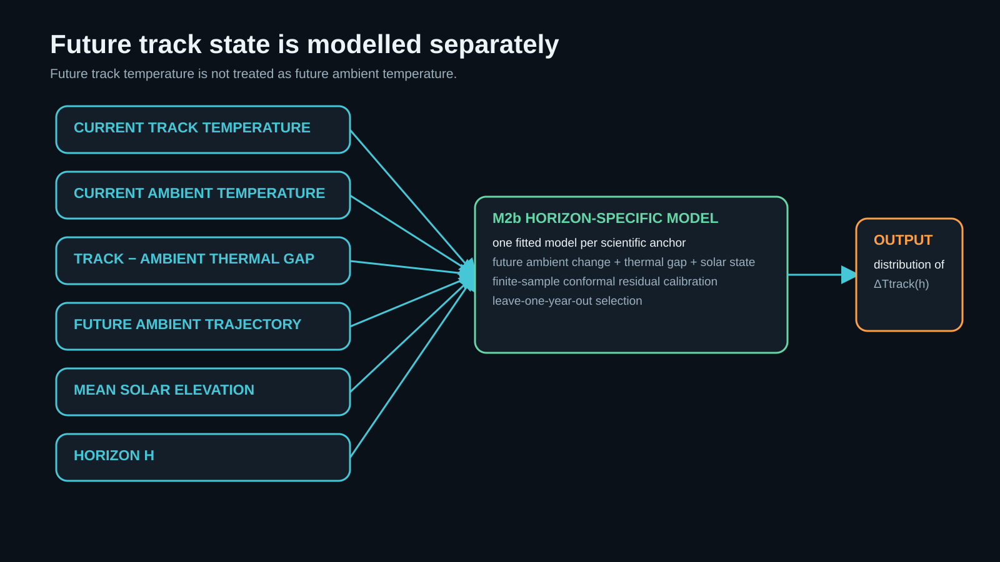

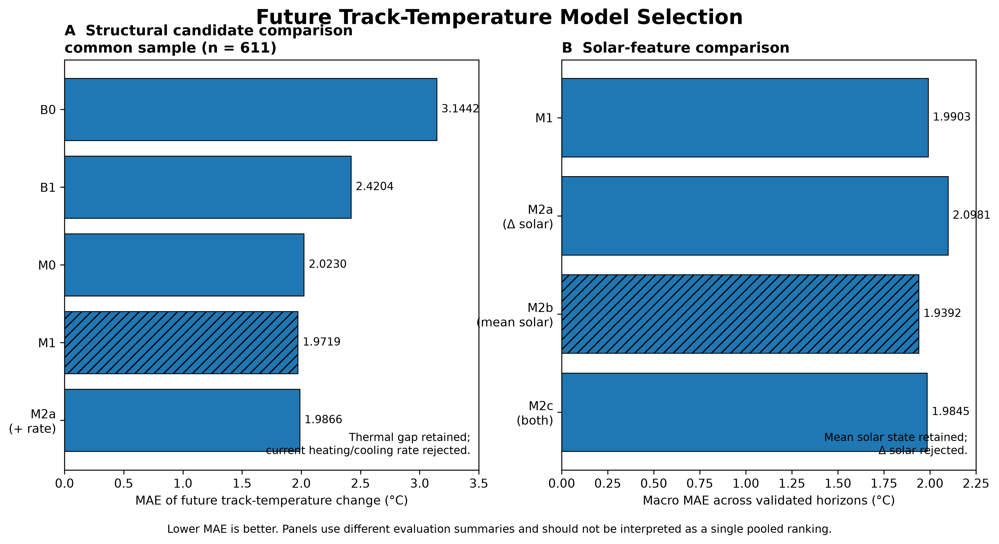

The solar-state extension is retained in the future track-state pathway. A direct solar performance coefficient is not added to the speed model. Current heating/cooling rate and change in solar elevation were investigated and rejected when their out-of-year evidence did not justify extra complexity.

## Probabilistic inference

FINAL_V2 propagates three sources of uncertainty:

- paired bootstrap uncertainty in the physical-response coefficients;
- horizon-specific future track-state uncertainty;
- empirical unexplained attempt-level performance variation from centered leave-one-year-out residuals.

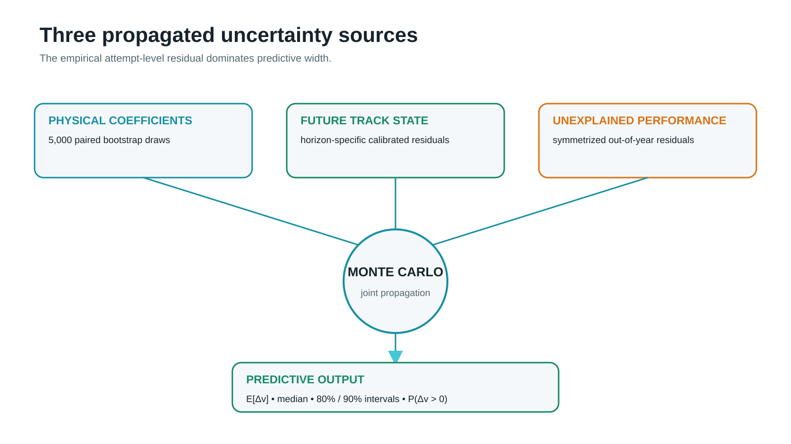

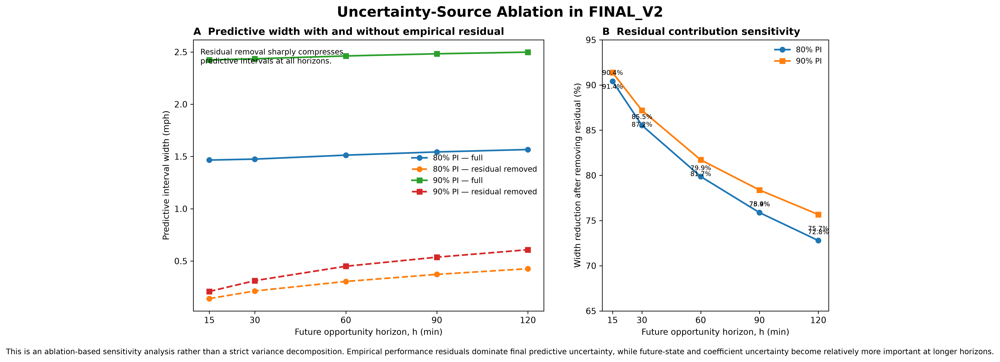

Removing empirical performance residual uncertainty reduces mean 80% interval width by about **90.4% at 15 minutes** and **72.8% at 120 minutes**. This is an uncertainty-source ablation and sensitivity result, not an orthogonal variance decomposition. It shows why better track-temperature point prediction alone cannot collapse the final outcome interval.

See [uncertainty architecture](docs/uncertainty.md).

## Calibrated support and operational interpolation

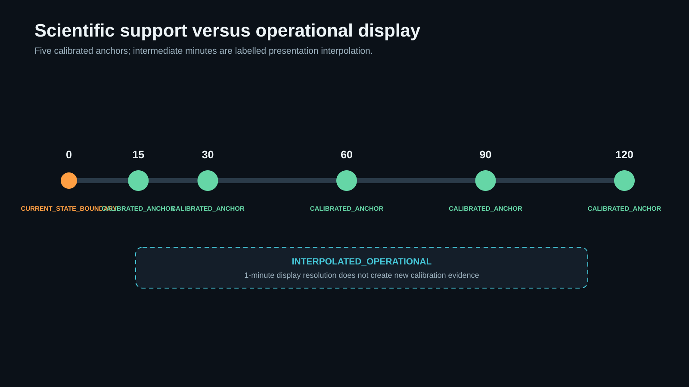

Scientific support exists at exactly **15, 30, 60, 90 and 120 minutes**. `OPERATIONAL_CURVE_V2` provides a one-minute display between anchors, with every row labelled as `CURRENT_STATE_BOUNDARY`, `CALIBRATED_ANCHOR` or `INTERPOLATED_OPERATIONAL`. The interpolated values are presentation summaries; they are not independently calibrated minute-by-minute forecasts.

## Diagnostics that interrogate rather than inflate the model

### Section-level mechanism evidence

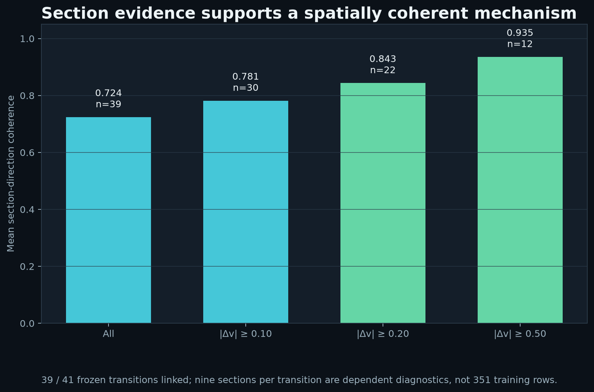

For the 39 linked transitions, mean directional coherence across nine common sections is **0.724** and rises to **0.935** for the 12 transitions with |Δv| ≥ 0.50 mph. Meaningful changes are generally spatially coherent. Large residuals can also be coherent, so section evidence clarifies mechanism without converting dependent section rows into extra training samples.

### Wind diagnostic

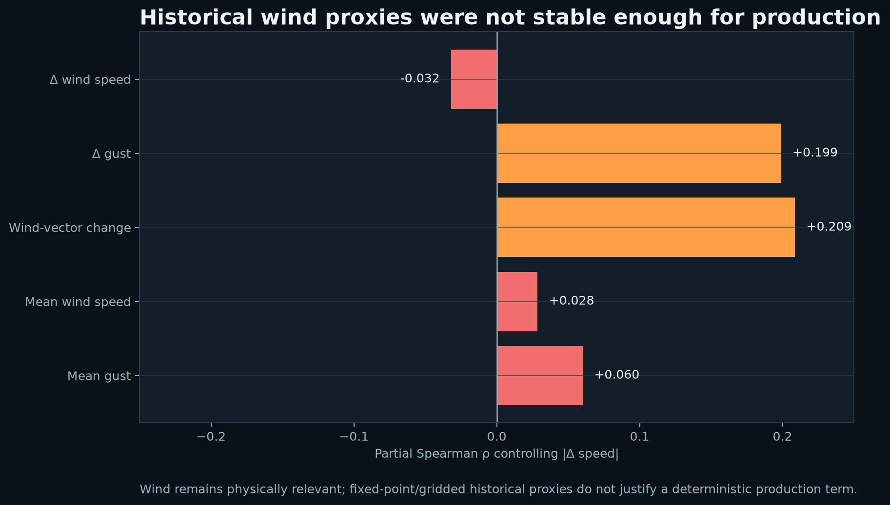

Wind is physically relevant. The available fixed-point and gridded historical proxies, however, showed weak or unstable out-of-year residual relationships. No deterministic wind coefficient or production residual-scale term was forced into FINAL_V2.

## Scenario stress test

The frozen model was exercised over **3 thermal-gap states × 3 ambient trajectories × 3 solar states × 5 horizons = 135 scenarios**. Every ambient trajectory remained within its corresponding historical support range.

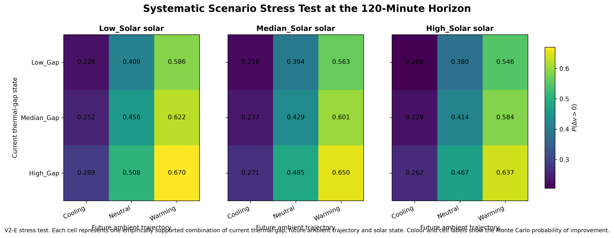

At 120 minutes, P(improvement) ranges from **0.2055 to 0.6704**, while expected Δspeed ranges from **−0.4630 to +0.2248 mph**. Physical state can materially shift the odds without eliminating outcome uncertainty. The grid remains conditional on an opportunity occurring; it contains no queue model.

## 2025 external validation

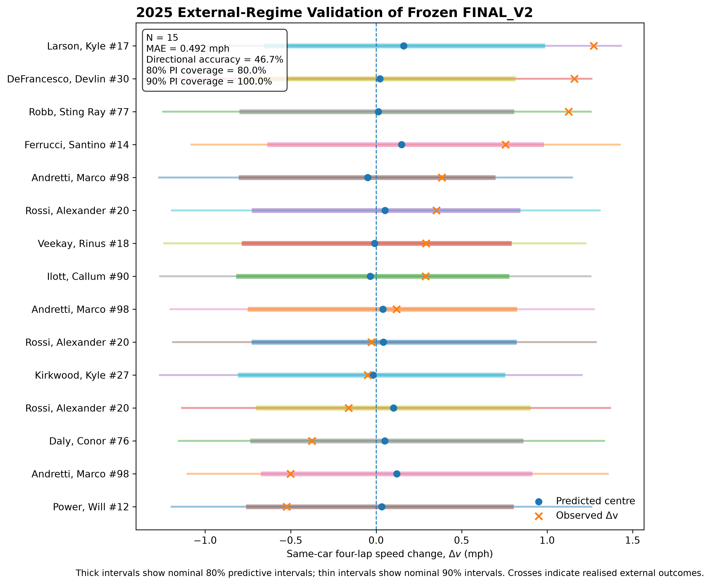

The frozen 2020–2024 inference core was evaluated on 15 eligible 2025 hybrid-era same-car repeats. The evaluation uses the realized PTSC ambient trajectory retrospectively, so it tests the physical-inference chain under a new technical regime; it is **not** live weather-forecast validation.

| Metric | All external cases ≤180 min | Production-boundary subset ≤120 min |
|---|---:|---:|
| N | 15 | 4 |
| MAE | 0.492 mph | 0.221 mph |
| Median absolute error | 0.425 mph | 0.190 mph |
| RMSE | 0.610 mph | 0.269 mph |
| Directional accuracy | 46.7% | 50.0% |
| 80% PI coverage | 80% | 100% |
| 90% PI coverage | 100% | 100% |

Cases above 120 minutes are marked as extended retrospective validation and are not production-supported outputs. The 100% 90% interval coverage is an observed rate in 15 cases, not proof of perfect long-run calibration. See [validation](docs/validation.md).

## Technical-regime transfer and format boundary

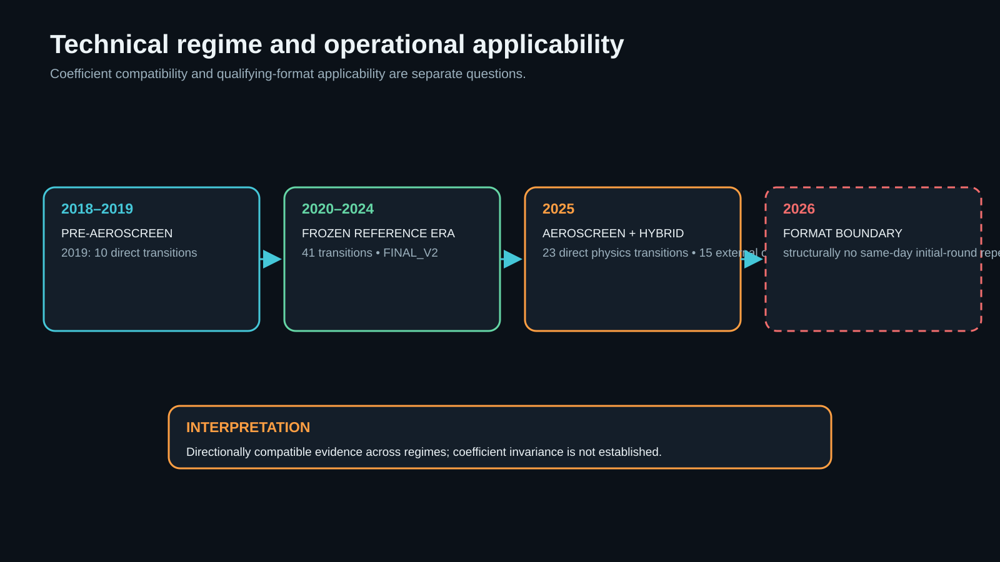

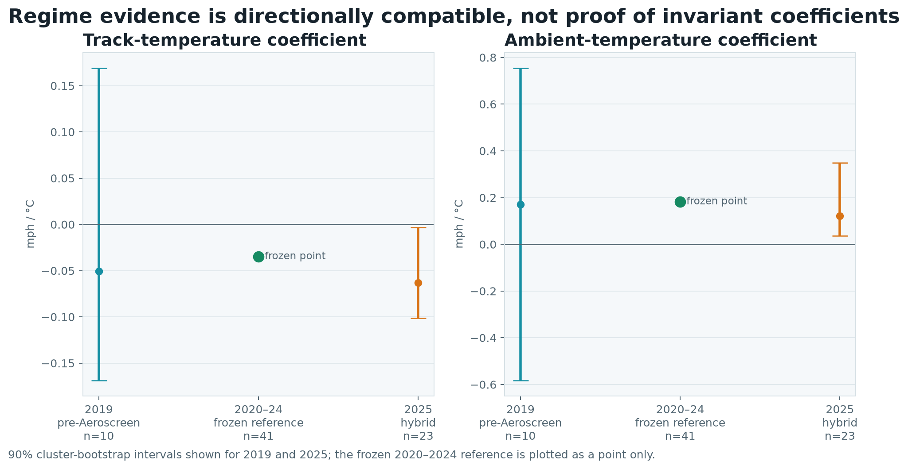

The 2019 pre-Aeroscreen and 2025 hybrid samples retain the same directional response as the reference core. All reported 90% bootstrap intervals for direct coefficient differences include zero. This is qualified compatibility evidence, not equivalence or causal proof of coefficient invariance. The 2026 format is separately classified as structurally lacking same-day initial-round repeat transitions.

See [regime transfer](docs/regime-transfer.md).

## Operational decision-support layer

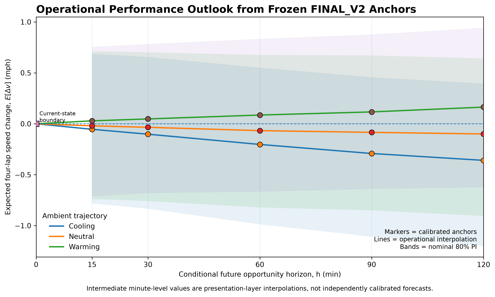

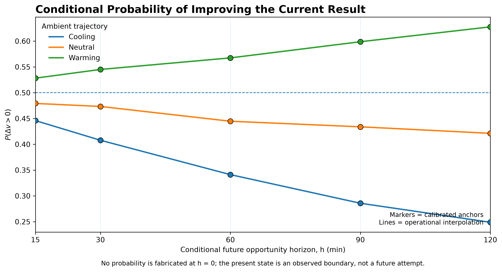

The model returns expected Δspeed, median Δspeed, 80% and 90% predictive intervals, and P(Δv > 0) for a supplied physical scenario and opportunity horizon. A real pit-wall decision must combine that evidence with live queue position, cars ahead, leaderboard state, session remaining, interruption risk, withdrawal consequences and engineering judgement.

It does not choose Lane 1 or Lane 2, predict an optimal wait, or recommend retain/withdraw actions. See [operational interface](docs/operational-interface.md).

## Evidence-based decisions: rejected or not retained

| Candidate | Decision | Evidence-based reason |
|---|---|---|
| Historical queue-time model | Rejected | Queue/lane/withdrawal states were not consistently observable |
| Direct solar speed term | Not retained | Solar enters through the future track-state mechanism |
| Deterministic wind term | Not retained | Historical proxy relationships were weak and unstable across years |
| Section rows as training observations | Rejected | Nine sections within a transition are dependent |
| Pooling 2025 into the frozen core | Rejected | Would destroy external validation integrity |
| Independent minute-level calibration | Rejected | Intermediate minutes are labelled operational interpolation |
| Unsupported high-capacity models | Rejected | The evidence base does not justify complexity for its own sake |

These are model-risk controls and engineering outputs, not unfinished work.

## Reproducibility and freeze discipline

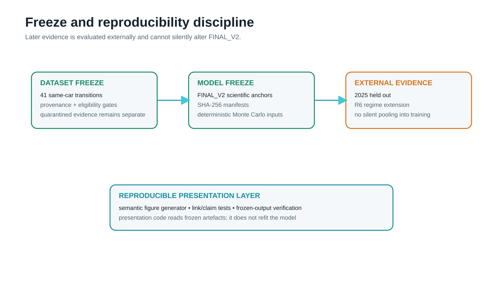

The repository contains frozen manifests and SHA-256 records for the performance core, FINAL_V2, diagnostics, operational curve and regulation extension. Portfolio scripts read those artefacts without refitting them. Later observations remain external unless a separately versioned research phase explicitly replaces the freeze.

```bash
python3 -m venv .venv
source .venv/bin/activate
python3 -m pip install -r requirements.txt

# Recreate only the curated GitHub figures from frozen outputs
make figures

# Verify public claims, figure references and frozen hashes
make portfolio-check

# Run repository smoke/integrity tests
make test
```

Raw public-source evidence is retained for audit where redistribution permits. Derived canonical tables, provenance records, quarantine outputs and freeze manifests are included. Some external services and historical replay resources are not guaranteed to remain available; the repository does not claim that every raw acquisition can be repeated indefinitely. See [reproducibility](docs/reproducibility.md).

## Repository map

```text
pipeline/                 source-specific ingestion and canonical reconciliation
data/canonical/v1/        canonical historical data products
weather/                  observed weather, future-state model and FINAL_V2 outputs
r5_2/                     frozen 2020–2024 physical-response core
r6_regime_extension/      2019/2025 regime evidence and external evaluation
figures/portfolio/        curated GitHub visual narrative
docs/                     technical documentation and final report
scripts/                  presentation regeneration and integrity checks
tests/                    pipeline and portfolio QA
```

For the detailed module and status inventory, open [the repository guide](docs/reproducibility.md) and [figure gallery](figures/GALLERY.md).

## Limitations

- The primary response dataset contains only 41 transitions.
- Exact queue opportunity and team-intent history remains unidentifiable from the public record.
- Latent setup, tyre preparation, execution and vehicle state dominate much of the predictive spread.
- The 2025 external sample is small, with only four cases inside the production horizon.
- Future-state validation uses realized historical ambient paths; end-to-end live forecast validation remains separate.
- 2022 shows a marked thermal-regime shift and future-track interval undercoverage.
- Wind proxies do not represent the spatial aerodynamic exposure around the oval.
- Technical transferability is qualified; qualifying-format applicability must be checked separately.

## Documentation

- [Identifiability boundary](docs/identifiability-boundary.md)
- [Methodology](docs/methodology.md)
- [Model card](docs/model-card.md)
- [Evidence engineering](docs/evidence-engineering.md)
- [Validation](docs/validation.md)
- [Uncertainty](docs/uncertainty.md)
- [Regime transfer](docs/regime-transfer.md)
- [Operational interface](docs/operational-interface.md)
- [Reproducibility](docs/reproducibility.md)
- [Technical challenges](docs/technical_challenges.md)
- [FINAL_V2 system specification](docs/final_v2_system_specification.md)
- [Full research report](docs/paper/physics_conditioned_probabilistic_performance_inference.pdf)

## Author and citation

**Fengzhe Li** · University College London

If this repository informs your work, cite the project and the versioned frozen artefacts used. The scientific core is `FINAL_V2`; the regulation-aware evidence extension is `R6_REGULATION_AWARE_EXTENSION_V1_FROZEN`.

