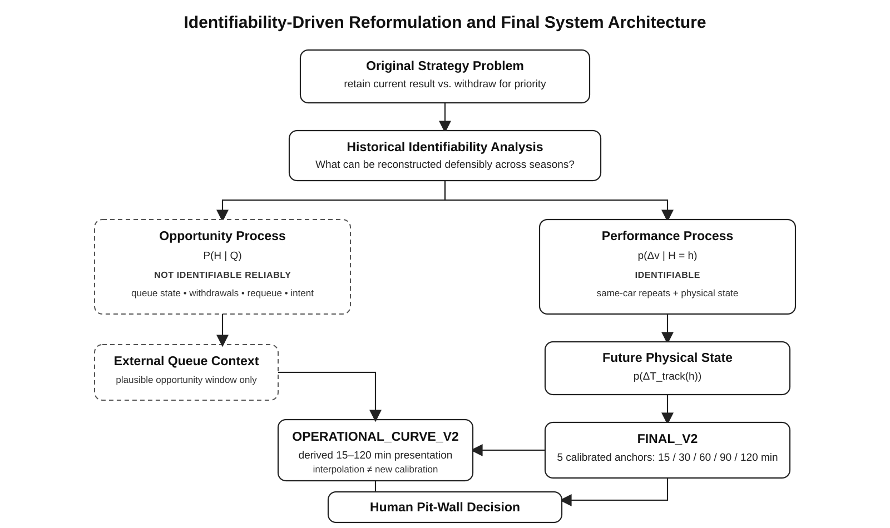
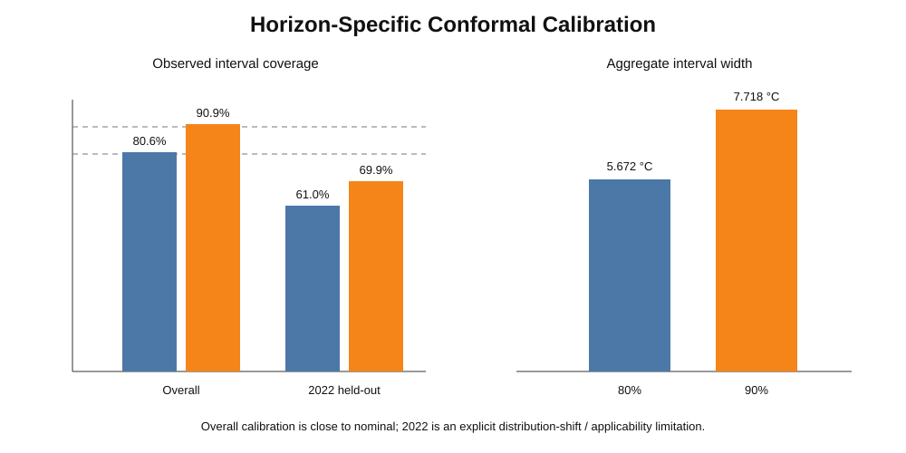
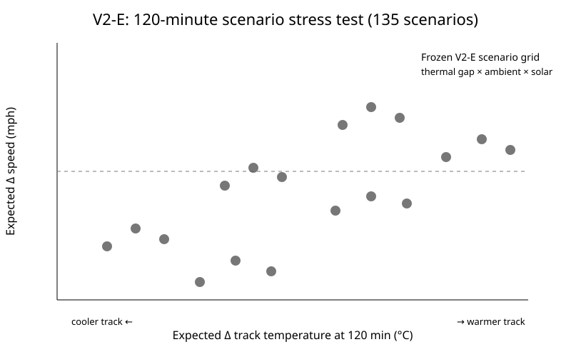
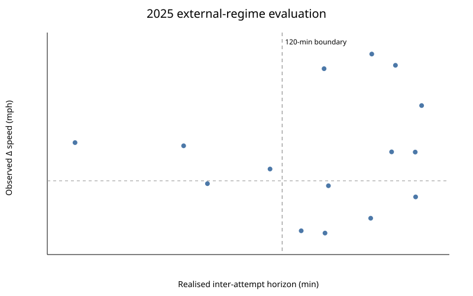
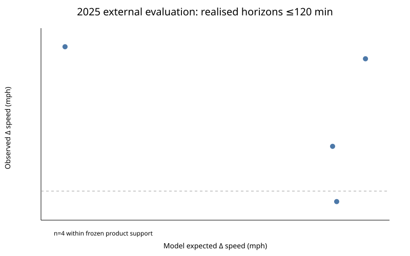
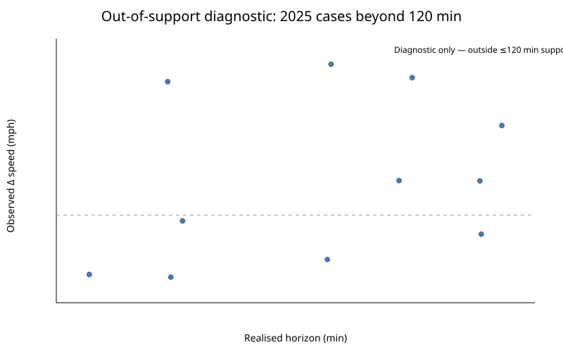

# Physics-Conditioned Probabilistic Performance Inference for Indianapolis 500 Qualifying

**Evidence engineering · physical-state inference · calibrated uncertainty · external-regime evaluation · operational decision support**

The original engineering question was operational: **should a team retain its current qualifying result or withdraw it to seek another run?** A historical identifiability audit showed that the opportunity process could not be reconstructed defensibly from public evidence: Lane 1/2 state, withdrawals, requeue timing, pit return, live queue position, exact timestamps, team intent and race-control effects were incomplete or inconsistent.

The project therefore does **not** fabricate a queue-time predictor. It reformulates the identifiable component as:

> **If another on-track opportunity occurs `h` minutes from now, what distribution of four-lap qualifying-performance change should be expected relative to the current official result?**

The scientific target is **p(Δv | H=h)**, not `P(H=h)`.

## 1. Identifiability-driven architecture



This boundary is central to the project: historical evidence supports conditional physical-performance inference, but not a defensible historical model of the opportunity/queue process. Live queue context can therefore be overlaid only as external decision context, not learned as `P(H|Q)` from the reconstructed archive.

## 2. Evidence engineering before modelling

The compact final response equation is only the visible end of a much larger reconstruction problem. The repository retains source registry, provenance, chronology constraints, field-level evidence links, eligibility rules, quarantine logic, canonical tables and QA outputs because these determine which historical transitions are scientifically usable.

The frozen 2020–2024 reference contains **41 evidence-qualified same-car transitions**. Same-car differencing reduces persistent car/driver/configuration effects while preserving the within-car environmental change relevant to a repeat attempt.

## 3. Frozen physical-response core

For an evidence-qualified same-car transition:

`Δv = β_track ΔT_track + β_ambient ΔT_ambient + ε`

with frozen coefficients:

- `β_track = -0.03482533`
- `β_ambient = +0.18239338`

The ambient coefficient is interpreted **conditionally**, not as an isolated universal causal effect, because the retained thermal variables are correlated. Paired bootstrap inference preserves their joint uncertainty; the bootstrap coefficient correlation is approximately **-0.9085**.

### Physical-state structure


### Observed versus frozen physical prediction


Internal median absolute point error is approximately **0.311 mph**. Nominal predictive-interval coverage is approximately **82.9% for 80% intervals** and **90.2% for 90% intervals**.

## 4. Future track-state inference

The future opportunity horizon is treated as a condition supplied to the model. Future track temperature is inferred from the current physical state and future environmental trajectory rather than manually supplied as an input.

The retained M2b structure uses horizon, ambient-temperature change, the current track-to-ambient thermal gap and mean future solar state. Solar is kept on the physical pathway through future track state; it is **not** inserted as a direct speed term.

### Paper Figure 1 — future track-temperature model selection


The retained M2b model achieved a macro MAE of approximately **1.939°C**, compared with **1.990°C** for the non-solar M1 reference. The PTSC-normalized track-temperature evidence contains 168 rows and 656 matched pairs.

## 5. Horizon-specific uncertainty calibration

Scientific calibration is frozen at exactly **15, 30, 60, 90 and 120 minutes**. The 120-minute boundary is empirical/model-validation support, not a rules-derived limit.

### Paper Figure 2 — conformal calibration



Overall conformal coverage is approximately **80.6% / 90.9%** for nominal 80% / 90% intervals. The difficult 2022 held-out regime remains visible, with substantially weaker coverage, and is treated as an explicit distribution-shift/applicability warning rather than hidden by aggregate performance.

### Calibration diagnostic


## 6. Uncertainty propagation and ablation

The final performance distribution propagates three distinct uncertainty sources: paired coefficient uncertainty, future physical-state uncertainty and empirical unexplained attempt-level performance variation. Empirical performance residuals dominate the final predictive width.


This is an **ablation/sensitivity analysis**, not a strict variance decomposition.

## 7. Systematic scenario stress testing

V2-E evaluates **135** combinations of thermal gap × ambient trajectory × solar state × horizon to test whether the frozen system behaves coherently across plausible operating conditions.



The stress test is used to expose behaviour and boundary cases; it is not a substitute for external validation.

## 8. Regulation-aware analysis

Technical regime and qualifying-format regime are kept separate. Three technical periods were investigated:

| Technical period | Statistical role | Quantitative evidence |
|---|---|---:|
| 2018–2019 pre-Aeroscreen | early-regime investigation | 2019: **10** clean transitions; 2018 insufficient after filtering |
| 2020–2024 Aeroscreen / pre-hybrid | frozen production reference | **41** transitions |
| 2025–2026 hybrid/later era | transferability + applicability analysis | 2025: **23** primary physics-safe transitions; 2026 mainly an applicability boundary |

Comparable coefficient fits preserve the same qualitative signs:

| Regime | N | β_track | β_ambient |
|---|---:|---:|---:|
| 2019 pre-Aeroscreen | 10 | -0.05059 | +0.17008 |
| 2020–2024 reference | 41 | -0.03483 | +0.18239 |
| 2025 hybrid era | 23 | -0.06308 | +0.12100 |

This does **not** justify claiming coefficient invariance across eras. The later samples are used to examine transferability rather than silently enlarging the frozen reference training set.

## 9. External 2025 evaluation

The frozen 2020–2024 inference chain was evaluated **without refitting** on **15 eligible 2025 hybrid-era repeat-attempt cases**.

| External metric | 2025 result |
|---|---:|
| MAE | **0.492 mph** |
| Median absolute error | **0.425 mph** |
| RMSE | **0.610 mph** |
| 80% PI coverage | **80.0%** |
| 90% PI coverage | **100.0%** |
| Directional accuracy | **46.7%** |
| Observed improvement rate | **60.0%** |

The weak directional accuracy is deliberately retained: `P(improve)` has limited classification separation in the external sample. The evidence therefore supports **uncertainty-aware physical inference** more strongly than deterministic faster/slower prediction.

### Full external-regime view



### Cases within the calibrated ≤120-minute support boundary



Only **4** of the 15 realised external horizons lie within the calibrated ≤120-minute production boundary. For these supported cases, MAE is approximately **0.221 mph**; longer-horizon cases are retained only as diagnostics.

### Beyond-120-minute applicability diagnostic



The 15-case end-to-end external evaluation must not be conflated with the separate **23-transition 2025 regulation-aware coefficient-comparison sample**.

## 10. Operational presentation layer

`FINAL_V2` is the frozen scientific/model layer. `OPERATIONAL_CURVE_V2` is a separate derived visualization layer.

At `h=0`, the current state is a deterministic boundary with expected/median Δspeed = 0; it is **not** represented as a fabricated probabilistic forecast. The calibrated anchors remain 15/30/60/90/120 minutes. Intermediate minute-level values are piecewise-linear interpolation of frozen output summaries, not new Monte Carlo runs or new calibration points.


No production output is extended beyond 120 minutes. No best-wait time, queue prediction or autonomous strategy recommendation is produced.

## 11. Diagnostics and rejected extensions

Negative results are part of the engineering evidence:

- **Queue/opportunity predictor:** rejected because the historical opportunity process is not reliably identifiable.
- **Direct solar performance term:** rejected; solar remains on the future-track-state pathway.
- **Wind performance term:** not retained because historical support was not sufficiently stable across years.
- **Section-level mechanism expansion:** used diagnostically; broad spatial coherence did not justify automatically expanding the production feature set.
- **Arbitrary minute-level scientific forecasts:** rejected; interpolation is isolated in the operational presentation layer.
- **Pooling 2025 into the reference fit:** rejected to preserve external-evaluation integrity.

## 12. What the system supports — and what it does not

The system supports conditional inference about how the **distribution** of four-lap performance may shift if another opportunity occurs at a specified horizon. It quantifies expected Δspeed, predictive intervals, `P(improve)` and expected future four-lap speed under the physical state model.

It does **not** predict `P(H|Q)`, exact queue duration, Lane 1 versus Lane 2 waiting time, competitor behaviour, team intent, weather-forecast skill, an optimal wait, or a withdraw/retain decision. A real pit-wall decision must combine this physical-performance evidence with live queue state, leaderboard position, remaining session time, driver feedback, competitors, team objectives, risk tolerance and race-control context.

## 13. Repository map

```text
├── README.md
├── docs/                  # identifiability boundary, methodology, model documentation
├── data/                  # canonical, provenance and plotting data
├── evidence/              # source/evidence work where publication-safe
├── figures/
│   ├── paper/             # figures explicitly aligned to the final manuscript
│   └── ...                # diagnostics, stress tests, external and operational views
├── pipeline/              # reconstruction, provenance, eligibility and QA
├── src/                   # selected frozen modelling/diagnostic implementations
├── results/               # frozen outputs, manifests, QA and external evaluation
├── paper/                 # technical report assets
├── requirements.txt
└── .gitignore
```

See the expanded [`figures/GALLERY.md`](figures/GALLERY.md) for the complete figure inventory and the distinction between paper-aligned figures and supplementary project assets.

## 14. Frozen status

- Scientific/model layer: **FINAL_V2 — FROZEN**
- Operational presentation layer: **OPERATIONAL_CURVE_V2 — FROZEN**
- Frozen reference regime: **2020–2024**
- Quantitative cross-regime comparison: **2019 / 2020–2024 / 2025**
- End-to-end external evaluation: **2025**
- 2026 role: **qualifying-format / applicability boundary**
- Scientific opportunity horizons: **15 / 30 / 60 / 90 / 120 min**

---

**Fengzhe Li — University College London**
