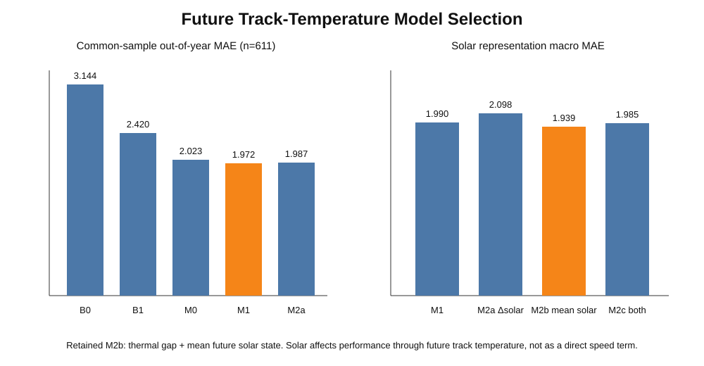
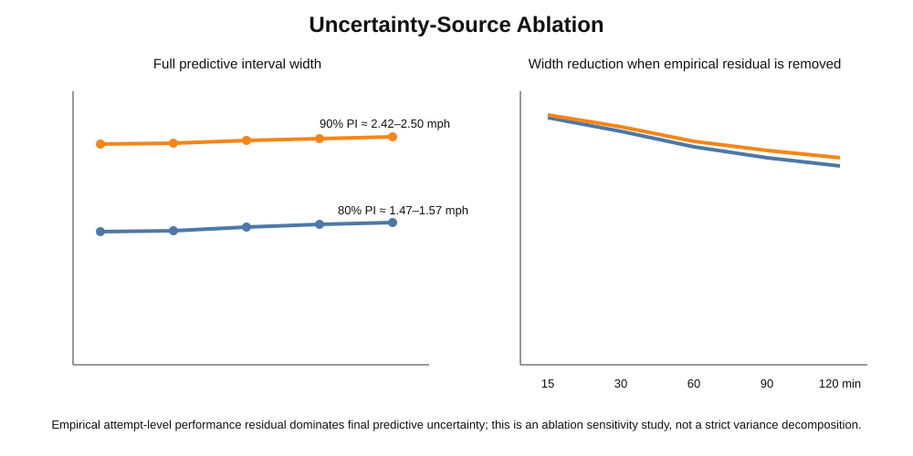
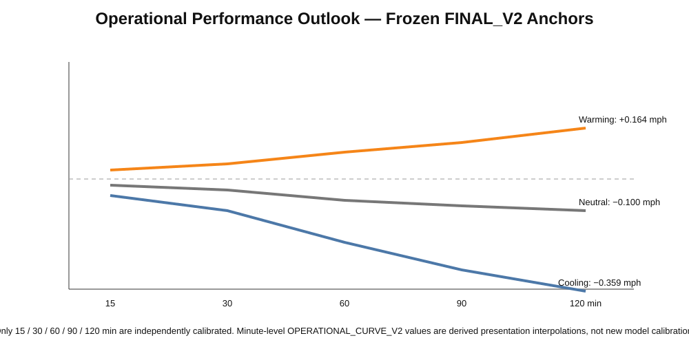

# Indy 500 Requalification / Result-Withdrawal Decision Support

**Physics-Conditioned Probabilistic Performance Inference for Indianapolis 500 Requalification / Result-Withdrawal Decision Support**

A multi-season motorsport decision-support project built from fragmented qualifying, timing and environmental records. The original pit-wall question was whether to preserve an existing qualifying result or withdraw it for priority and another attempt. Historical reconstruction showed that the queue/opportunity process could not be identified reliably enough for a defensible queue-time model, so the problem was deliberately reformulated.

> **Final scientific question:** If another on-track opportunity occurs `h` minutes from now, what distribution of four-lap qualifying-performance change should be expected relative to the current official result?

The system estimates **p(Δv | H = h)**. It does **not** estimate `P(H=h)`, predict queue waiting time, or automatically recommend a withdraw/retain strategy.

## Why this project is technically difficult

The final regression is intentionally compact; the difficult part is the system around it:

- multi-season attempt chronology reconstruction from fragmented evidence;
- provenance, evidence hierarchy and quarantine of ambiguous records;
- explicit **identifiability analysis** before choosing the modelling target;
- same-car differencing to reduce persistent configuration effects;
- physics-conditioned thermal response modelling;
- future track-state inference using current thermal gap and future solar state;
- leave-one-year-out evaluation and paired bootstrap coefficient uncertainty;
- horizon-specific conformal calibration;
- Monte Carlo propagation of parameter, future-state and empirical performance uncertainty;
- section-level mechanism and wind residual diagnostics;
- uncertainty-source ablation and a 135-scenario stress test;
- frozen 2020–2024 reference core evaluated on 2025 hybrid-era repeat attempts;
- a separate operational layer preserving the distinction between calibrated anchors and interpolated presentation values.

## Architecture

```text
Real strategy problem
    ↓
Data archaeology + chronology reconstruction
    ↓
Identifiability analysis
    ├── queue/opportunity process P(H|Q): not reliably reconstructable
    └── performance process p(Δv|H=h): defensibly identifiable
             ↓
41 frozen same-car transitions (2020–2024)
             ↓
Physics-conditioned performance core
             + future track-state model
             + bootstrap / conformal / residual uncertainty
             ↓
Monte Carlo conditional performance distribution
             ↓
FINAL_V2 calibrated anchors: 15 / 30 / 60 / 90 / 120 min
             ↓
OPERATIONAL_CURVE_V2 presentation layer
             ↓
Human pit-wall decision + external live context
```

## Frozen performance core

`Δv = β_track ΔT_track + β_ambient ΔT_ambient + ε`

- `β_track = -0.03482533`
- `β_ambient = +0.18239338`

The ambient coefficient is treated conditionally rather than as a universal causal effect because the retained thermal variables are correlated.

## Future physical-state inference

The retained future-track specification uses future horizon, ambient trajectory, current thermal gap and mean future solar state. Solar informs track heating/cooling; it is **not** inserted as a direct qualifying-speed term.



Supported calibrated horizons are exactly **15, 30, 60, 90 and 120 minutes**. The 120-minute limit is an empirical/model-validation boundary, not a rules-derived limit.

## Calibrated uncertainty

Future track-state uncertainty is calibrated horizon-by-horizon. Aggregate historical coverage is close to nominal, while the difficult 2022 held-out season is retained as an explicit distribution-shift limitation.


The final distribution propagates coefficient uncertainty, future physical-state uncertainty and empirical unexplained attempt-level performance variation.



The empirical performance residual dominates final predictive width. This is an ablation/sensitivity result, not a strict variance decomposition.

## External 2025 evaluation

The frozen 2020–2024 core was evaluated on **15 eligible 2025 hybrid-era repeat-attempt cases** without refitting the reference core.

| Metric | Result |
|---|---:|
| Cases | 15 |
| MAE | **0.492 mph** |
| Median absolute error | **0.425 mph** |
| RMSE | **0.610 mph** |
| Nominal 80% PI coverage | **80.0%** |
| Nominal 90% PI coverage | **100.0%** |
| Directional accuracy | **46.7%** |

The weak directional classification is important: this is better interpreted as **probabilistic physical-state decision support** than as a standalone binary next-attempt predictor.

## Operational presentation layer

`FINAL_V2` is the scientific/model layer. `OPERATIONAL_CURVE_V2` is a derived visualization layer and remains separate.



Only the five anchors are independently calibrated. Intermediate 15–120 minute values are piecewise-linear interpolation of frozen output summaries for visualization, not new Monte Carlo calibrations. No output beyond 120 minutes is production-supported.

## Selected diagnostics

**V2-B — section mechanism analysis.** Meaningful changes are generally broad and spatially coherent rather than isolated to a few sections. This improves mechanism interpretation but does not justify expanding the predictive feature set.

**V2-C — wind diagnostic.** Available historical wind proxies did not provide sufficiently stable evidence to justify an explicit deterministic or heteroskedastic wind term. This does not imply that wind has no physical effect.

**V2-D — uncertainty ablation.** Empirical attempt-level residual variation dominates final predictive uncertainty.

**V2-E — stress testing.** 135 combinations of thermal gap × ambient trajectory × solar state × horizon were evaluated systematically.

## Repository map

```text
├── README.md
├── docs/                  # methodology and design rationale
├── data/                  # documented modelling / plotting data
├── figures/               # core technical visualisations
├── pipeline/              # reconstruction, provenance, eligibility, validation
├── src/                   # selected modelling and diagnostic scripts
├── results/final_v2/      # frozen specification and manifests
├── paper/                 # final technical report
├── requirements.txt
└── .gitignore
```

The public repository is intentionally broader than a minimal model demo: it retains evidence of the reconstruction, validation and uncertainty-engineering work that makes the compact final model defensible, while excluding caches and redundant exploratory artefacts.

## Status

- Scientific/model layer: **FINAL_V2 — FROZEN**
- Operational visualization layer: **OPERATIONAL_CURVE_V2 — FROZEN**
- Reference regime: **2020–2024**
- External technical-regime evaluation: **2025 hybrid era**
- Supported future-opportunity anchors: **15 / 30 / 60 / 90 / 120 min**

## Scope boundary

This does not replace pit-wall judgement. A real withdraw/retain decision also depends on live queue state, leaderboard position, competitors, driver feedback, team risk tolerance and race-control context. The project isolates the historically defensible physical-performance component and quantifies it probabilistically.

---

**Fengzhe Li — University College London**
