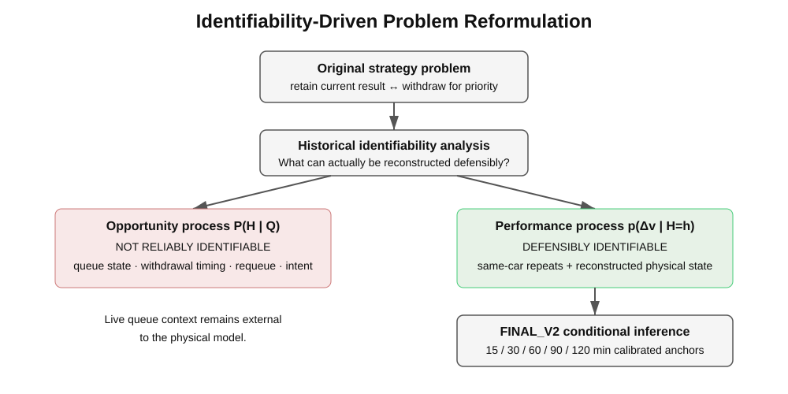
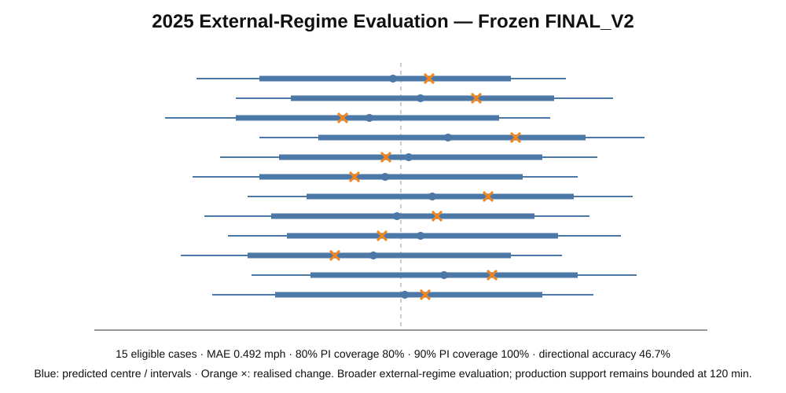

# Technical Challenges and Engineering Decisions

This document highlights the parts of the project that are easy to miss if the final model is viewed only as a compact regression.

## 1. The original target was not reliably identifiable

The initial strategy question was closer to a direct retain-versus-withdraw / requalification problem. A useful historical strategy model would have required consistent reconstruction of lane state, exact withdrawal timing, requeue behaviour, pit return, live queue order, race-control interruptions and team intent.

Those variables were not consistently recoverable across the historical seasons. Rather than manufacture queue-time labels, the project treated this as an identifiability result and changed the research question.

The final system conditions on a scenario horizon `H=h` and estimates the performance distribution `p(Δv | H=h)`. Opportunity-time uncertainty remains external.

## 2. Data archaeology before modelling

There was no ready-made attempt-level dataset containing all required repeat attempts, four-lap results, chronology, section evidence and physical conditions. The research workspace therefore contains explicit reconstruction machinery for:

- source registration and provenance;
- reconciliation of heterogeneous records;
- attempt identity and chronology constraints;
- row-level eligibility;
- quarantine of ambiguous evidence;
- canonical materialization;
- validation / QA before modelling.

This is why the public project preserves reconstruction and QA artefacts instead of presenting only the final modelling table.

## 3. Same-car transition design

The modelling unit is a transition between consecutive evidence-qualified attempts by the same car. This reduces persistent between-car setup and driver effects and focuses inference on change in physical state versus change in four-lap performance.

The frozen 2020–2024 core contains 41 transitions. A small sample is treated as a constraint: the project uses a compact interpretable model, leave-one-year-out checks and explicit uncertainty rather than adding a large feature set.

## 4. Physics-conditioned rather than feature-maximal

The frozen performance core uses changes in track and ambient temperature. Candidate information such as solar and wind was not automatically added to the final speed model.

Solar was retained upstream in the future track-temperature model because its physically interpretable path is:

`solar geometry → track heating → track temperature → performance`

Historical wind proxies were investigated separately. They did not provide sufficiently stable evidence to justify an explicit deterministic or heteroskedastic wind term. This is a feature-rejection result, not a claim that wind has no physical effect.

## 5. Future-state modelling is separate from performance response

The project does not assume future track temperature is known. A separate model estimates future track-temperature change from horizon, ambient trajectory, current thermal gap and mean future solar state.

Model selection was performed out of year, including tests of current heating/cooling rate and alternative solar representations.

## 6. Three uncertainty sources are propagated

The final Monte Carlo inference combines:

1. paired bootstrap coefficient uncertainty;
2. calibrated future track-state uncertainty;
3. symmetrized empirical leave-one-year-out performance residuals.

Future track uncertainty uses horizon-specific conformal calibration rather than a single pooled residual width.

Ablation shows that unexplained attempt-level performance variation dominates final predictive width.

## 7. Diagnostics are used to reject unsupported complexity

Section-level evidence is used for mechanism interpretation. Large performance changes and large thermal-model residuals are commonly spatially coherent, so unexplained variation should not be interpreted primarily as a few localized driver/section anomalies.

Wind and section diagnostics therefore improve interpretation without being used to inflate the feature set or effective training sample.

## 8. External technical-regime transfer is separated from support boundaries

The frozen 2020–2024 core is evaluated on 15 eligible 2025 hybrid-era repeat attempts. The broader external-regime evaluation is useful for technical transferability, while the calibrated production horizon remains capped at 120 minutes.

This distinction prevents external diagnostics from silently extending the frozen model's validated operating range.

## 9. Scientific and operational layers are frozen separately

`FINAL_V2` contains the scientific inference system at five calibrated anchors: 15, 30, 60, 90 and 120 minutes.

`OPERATIONAL_CURVE_V2` is a derived minute-level visualization between those anchors. Its intermediate values are interpolation of frozen output summaries, not independently calibrated forecasts.

This separation is deliberate model-governance work: the UI can be operationally convenient without overstating what the scientific model has actually validated.

## 10. What the system deliberately does not claim

The project does not predict queue waiting time, infer `P(H|Q)`, choose an optimal waiting time, or automatically issue a withdraw/retain recommendation. Live queue state, leaderboard position, competitors, driver feedback, vehicle condition, race control and team risk tolerance remain external decision inputs.

The engineering objective is narrower: quantify one defensible physical-performance component of a larger real pit-wall decision.