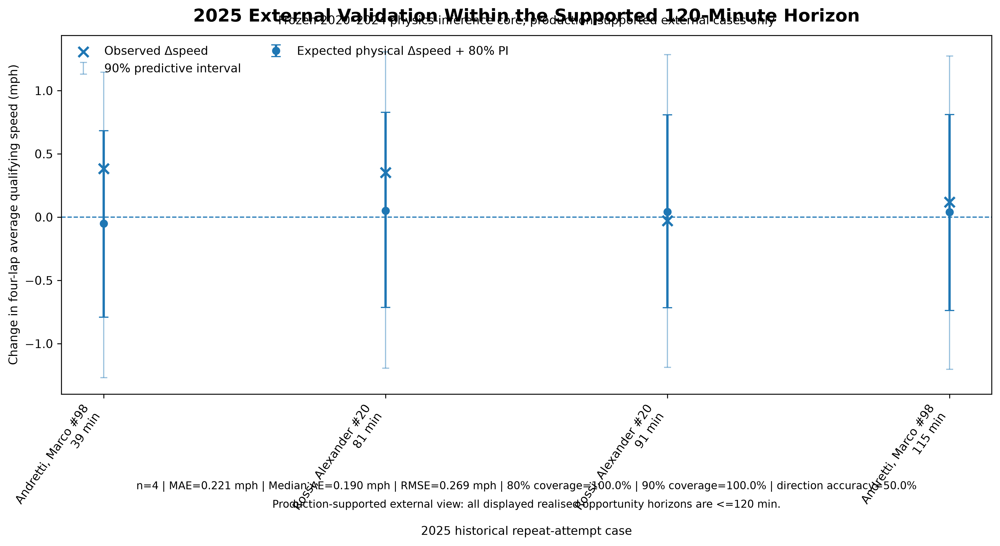

# Figure gallery

Repository figure names are semantic. Manuscript numbering is kept only in the paper and legacy publication assets. The curated set below is generated or copied by `scripts/generate_portfolio_figures.py`.

| Preview | Purpose | Source analysis | Scientific status |
|---|---|---|---|
|  | Identifiability-driven scope and human decision boundary | Historical reconnaissance + FINAL_V2 specification | System architecture |
|  | End-to-end evidence and model pipeline | Canonical pipeline through FINAL_V2 | System architecture |
|  | Verified products and distinct observation units | R5.2, V2-A, V2-B, 2025 evaluation | Evidence summary |
|  | Evidence authority and quarantine | Canonical eligibility rules | Evidence summary |
|  | Same-car differencing design | Frozen response core | Methodology |
|  | Frozen zero-intercept response and coefficients | R5.2 FINAL_V2 | Frozen model |
|  | Separate future track-state layer | V2-A | Frozen model |
|  | Out-of-year future-state candidate comparison | V2-A | Paper-aligned result |
|  | Three propagated sources | FINAL_V2 | System architecture |
|  | Predictive-width sensitivity | V2-D | Frozen diagnostic |
|  | Calibration versus interpolation | OPERATIONAL_CURVE_V2 | Operational semantics |
|  | Spatial coherence without sample inflation | V2-B | Frozen diagnostic |
|  | Rejected wind extension | V2-C | Frozen diagnostic |
|  | 120-minute physical-state scenario surface | V2-E | Frozen stress test |
|  | All 15 external cases and support boundary | R6 external evaluation v2 | External validation |
|  | Four cases within production horizon | R6 external evaluation v2 | External validation subset |
|  | Technical and format boundaries | R6 frozen extension | Transfer/applicability |
|  | Coefficient estimates and 90% intervals | R6 regime comparison | Supporting transfer analysis |
|  | Expected speed and predictive bands | OPERATIONAL_CURVE_V2 | Operational presentation |
|  | Conditional P(improvement) curve | OPERATIONAL_CURVE_V2 | Operational presentation |
|  | Versioning and external-evidence separation | Freeze manifests | Reproducibility architecture |

The SVG diagrams are explanatory views. Numerical plots are generated from or copied byte-for-byte from frozen outputs. None of the gallery assets refits a scientific model.

## Manuscript-aligned and supplementary source assets

These legacy names retain the numbering used during paper production. They remain evidence-grounded source assets; GitHub-facing references use the semantic names above.

| Asset group | Purpose | Source analysis | Scientific status |
|---|---|---|---|
| [`figure3a_physical_state_transitions`](figure3a_physical_state_transitions.png), [`figure3b_observed_vs_frozen_prediction`](figure3b_observed_vs_frozen_prediction.png) | Physical-state examples and frozen response comparison | R5.2 response core | Paper-aligned |
| [`figure4_future_track_model_selection`](figure4_future_track_model_selection.png) | Candidate future-state comparison | V2-A | Paper-aligned; curated semantic copy used above |
| [`figure5_conformal_calibration`](figure5_conformal_calibration.png) | Future track-state interval calibration | V2-A | Paper-aligned |
| [`figure6_uncertainty_ablation`](figure6_uncertainty_ablation.png) | Uncertainty-source sensitivity | V2-D | Paper-aligned; curated semantic copy used above |
| [`figure7_v2e_120min_stress_test`](figure7_v2e_120min_stress_test.png) | 120-minute scenario matrix | V2-E | Paper-aligned; curated semantic copy used above |
| [`figure8_external_2025_validation`](figure8_external_2025_validation.png), [`supported subset`](figure8_external_2025_supported_120min.png) | 2025 external evaluation | R6 evaluation v2 | Paper-aligned; semantic copies used above |
| [`appendix_external_2025_beyond_120min`](appendix_external_2025_beyond_120min.png) | Cases beyond production boundary | R6 evaluation v2 | Extended retrospective diagnostic |
| [`figure9a_operational_performance_curve`](figure9a_operational_performance_curve.png), [`figure9b_probability_improvement_curve`](figure9b_probability_improvement_curve.png) | Continuous presentation from frozen anchors | OPERATIONAL_CURVE_V2 | Paper-aligned; semantic copies used above |
| [`figure10a_scenario_probability_range`](figure10a_scenario_probability_range.png), [`figure10b_scenario_performance_envelope`](figure10b_scenario_performance_envelope.png) | Horizon-wise stress-test envelope | V2-E | Supplementary frozen diagnostic |
| [`figure11a_loyo_beta_track`](figure11a_loyo_beta_track.png), [`figure11b_loyo_beta_ambient`](figure11b_loyo_beta_ambient.png) | Leave-one-year-out coefficient stability | R5.2 response core | Supplementary diagnostic |
| [`figure12a_queue_context_performance_overlay`](figure12a_queue_context_performance_overlay.png), [`figure12b_queue_context_probability_overlay`](figure12b_queue_context_probability_overlay.png) | Externally supplied opportunity-window overlay | OPERATIONAL_CURVE_V2 | Operational illustration; not a queue prediction |

Matching PDF versions preserve publication-quality export, and adjacent plotting-data CSV files retain auditable figure inputs. The obsolete duplicate with a non-semantic `_副本` suffix and the superseded standalone root architecture export were removed during the consistency audit.
