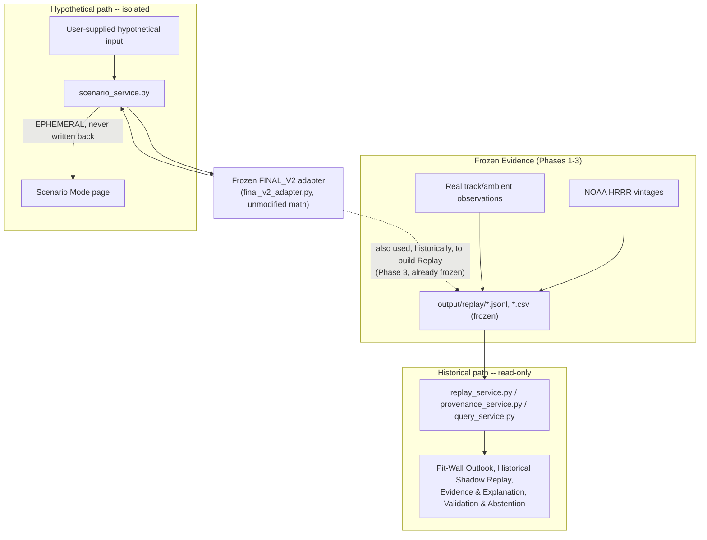

# FINAL_V3 Architecture

This document explains the complete layered architecture of the INDY 500
V3 Point-in-Time Probabilistic Decision Support system, and the one
separation every reader must come away understanding:

```
FROZEN HISTORICAL EVIDENCE                 HYPOTHETICAL USER INPUT
            |                                          |
            v                                          v
     READ-ONLY API                          FROZEN SCIENTIFIC ENGINE
            |                                          |
            v                                          v
  (Historical Shadow Replay,             EPHEMERAL SCENARIO OUTPUT
   Evidence & Explanation,                (never written anywhere,
   Validation & Abstention)                never enters the left column)
```

These two paths share the frozen scientific engine but never share
storage, state, or validation metrics. A request on the right can never
retroactively become evidence on the left.

## Layers, bottom to top

### 1. Evidence layer (Phases 2-3, frozen)
Real, non-fabricated data: NOAA HRRR forecast vintages
(`weather/output/hrrr_ims_2020_2024_features.csv`), real observed
track/ambient readings, and the pipeline's own reconstructed attempt
chronology. Nothing here was created by this project -- it is read,
never generated.

### 2. Frozen FINAL_V2 scientific layer
The physical-response model itself: fitted M2b track-temperature
coefficients, a residual-bootstrap Monte Carlo performance-response
core, and the operational curve metadata that defines the five
calibrated horizons (15/30/60/90/120 min) and the 120-minute production
boundary. `src/final_v2_adapter.py` imports its two pure helper
functions and the solar-geometry function directly from the original
frozen scripts (`weather/scripts/v2_integrate_track_to_performance_mc.py`,
`weather/scripts/v2_add_solar_features.py`) -- it does not reimplement,
retrain, or modify any of it.

### 3. Point-in-time layer (Phase 1)
`src/point_in_time_guard.py`, `src/forecast_vintage_store.py`,
`src/decision_snapshot.py`: the fail-closed leakage guard and the
`issue_time <= decision_time` forecast-selection rule that make it
possible to ask "what could the system defensibly have known at time
t?" without ever answering with information from the future.

### 4. Shadow replay layer (Phase 3)
`src/replay_engine.py`: turns the point-in-time execution path into an
auditable, time-ordered sequence of `ReplayEvent` records over all 41
real same-car transitions Phase 2 identified. Structurally separates
**inference support** (can FINAL_V2 issue a conditional outlook at a
calibrated anchor?) from **historical evaluation support** (can that
outlook be defensibly scored against a realised future attempt?).
Abstention is a first-class event type, not a dropped row or a raised
exception.

### 5. Read-only historical API (Phase 4)
`app/replay_service.py`, `app/provenance_service.py`,
`app/query_service.py`: read *only* the already-frozen Phase 3 output
files (`output/replay/*.jsonl`, `*.csv`) and Phase 1-3 QA/freeze
artifacts. **These three modules never import `final_v2_adapter`,
`shadow_engine`, or any Monte Carlo code** (enforced by
`tests/test_phase5_final.py`'s AST-level import check). There is no
code path by which the historical API could recompute, and therefore no
code path by which it could recompute *differently*.

### 6. Isolated hypothetical scenario API (Phase 5)
`app/scenario_service.py` is the **only** `app/` module permitted to
import scientific code. It calls the exact same `final_v2_adapter.infer()`
function the historical replay engine calls, on user-supplied
hypothetical current-state and hypothetical future-ambient input. Its
output is constructed in memory and returned; nothing in this module
writes to disk. A minimum, scientifically-derived input contract (three
required floats + one optional timestamp) was extracted directly from
what `final_v2_adapter.infer()` actually requires -- no field was added
because it "looked useful."

### 7. React dashboard (Phase 4-5)
Five pages (`frontend/src/pages/`) consuming the API exclusively through
`frontend/src/services/api.ts`. No physics, statistics, or scientific
formula exists anywhere under `frontend/` -- every number the UI shows
is a verbatim pass-through of an API response.

### 8. QA / immutability / regression protection (all phases)
`scripts/run_v2_immutability_check.py` (32/32 frozen dependencies,
byte-hash comparison against a pre-implementation baseline),
`scripts/run_v3_v2_behavioral_regression.py` (V3's adapter vs. the
frozen batch script's own recorded output, within Monte-Carlo sampling
tolerance), and `app/health_service.py` (`/api/system/readiness`,
which reuses the same 32-file baseline so there is exactly one
definition of "the frozen dependency set" in the whole project) all run
on every phase's completion and again before the FINAL_V3 freeze.

## Request-flow diagram



## What must never happen (and is tested)

- A scenario response must never be written into `output/replay/`,
  `output/evaluation/`, or any Phase 2/3 frozen file
  (`tests/test_scenario.py::test_6_...`, source-scanned for write-mode
  file I/O).
- `/api/validation/summary` must return identical counts before and
  after any number of scenario calls (`test_7_...`).
- The historical API modules must contain zero imports of scientific
  inference code (`tests/test_phase5_final.py::test_18_...`, verified
  via `ast.parse`, not a grep that a renamed import could dodge).
